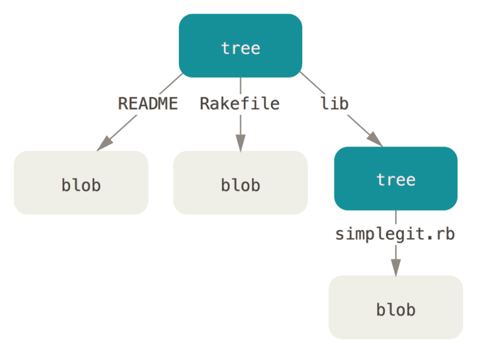

---
title: Maven & Git
titlepage: false
lot: false
toc: false
author:
- Bolliger Cyrill Alexander
- Schneider Marc
- Schär Marius
fontsize: 10pt
classoption:
- twocolumn
geometry:
- margin=10mm
...

# Maven
## Build tool
Maven is a powerful build tool for java projects.
It is used to manage and describe:

 - Standard life cycle for projects (compile, test, package, deploy)
 - Structuring projects (predefined file structure)
 - Definition and management of project dependencies
 - Version management of dependencies
 - Creation of projects from templates

Maven can scope dependencies to be included on:

 - Compilation
 - Runtime
 - Provided (only to compile, not on runtime. Example: Servlet API)
 - Test (dependency is only included for automated testing. Example: JUnit)

## Configuration file: pom.xml
The `pom.xml` is a **p**roject **o**bject **m**odel with xml format.

Example `pom.xml`
```xml
<project>
  <modelVersion>4.0.0</modelVersion>
  <groupId>com.mycompany.app</groupId>
  <artifactId>my-app</artifactId>
  <version>1.0.0</version>
  <dependencies>
    <dependency>
      <groupId>org.springframework</groupId>
      <artifactId>spring-core</artifactId>
      <version>5.2.9.RELEASE</version>
      </dependency>
  </dependencies>
</project>
```

While the dependencies are probably the most useful, but still optional
feature of maven, the following properties are mandatory:

 - `groupId`  - package path of the project
 - `artifactId`  - name of your project
 - `version`  - a version your project.

Via the `pom.xml` it is also possible the specify
arbitrary code repositories, custom plugins, project
inheritance etc. Any details may be found in the official
[introduction](https://maven.apache.org/guides/introduction/introduction-to-the-pom.html).

## File structure
Maven embraces the convention over configuration principle. This incites to
adhere to the following file structure:
```
src
    src/main
        src/main/java
        src/main/resources
    src/test
        src/test/java
target
    target/classes
```

 - `src` - all source code
 - `src/main/java` - entry point for the applications source
 - `src/main/resources` - other files that are needed at runtime
 - `src/test` - anything related to automated tests
 - `src/test/java` - the test sources (p.ex. JUnit classes)

## Quick start guide
* Get and install maven: [maven.apache.org](http://maven.apache.org/)
* `mvn validate` - check if configuration is valid and all necessary
information is available
* `mvn compile` - does what is says :)
* `mvn test` - runs automated tests (if set up)
* `mvn package` - builds your `.jar`, `.war` or whatever you've configured
* `mvn deploy` - ships your package
* `mvn clean` - removes all (intermediate) build files


# Git
## Further Reading
For further reading about Git,
We recommend the book _Pro Git_.
It's free, and can be found on [the Git
website](https://git-scm.com/book/en/v2).
If you're looking for something in video form,
[Lecture 6 of _The Missing
Semester_](https://missing.csail.mit.edu/2020/version-control/)
is also quite good.

## History
Git is an open source version control system (VCS),
which was developed by Linus Torvalds in 2005
because the current VCS used for Linux Kernel development
was no longer sufficient.
^[[git-scm.com A short 
history](https://git-scm.com/book/en/v2/Getting-Started-A-Short-History-of-Git)]
Some of the goals for Git were:

* Speed
* Simple design
* Support for parallel development
* Fully distributed
* Efficiently handle large projects

## Quick Start Guide
* Get and install Git:
[git-scm.com/downloads](https://git-scm.com/downloads)
* `git clone git@github.com/dude/project` - get a local copy of the project
* `git fetch` - get the latest changes from the server, without applying
them to your working copy
* `git status` - list the changes on your working copy and show, if they
are included in your next commit
* `git add <pathspec>` - add the specified file (also multiple files and
globing allowed) to the next commit (stage the file)
* `git restore --staged <pathspec>` - remove the specified file from the commit
list (unstage the file), but keep the local changes
* `git commit -m <message>` - commit the staged files and add the specified
commit message
* `git diff` - show changes between the latest commit and the working copy
* `git push` - send the commits of the current branch to the repository
* `git pull` - get the latest commits of the current branch from the repository
* `git checkout <branch>` - switch to the specified branch. Use `-b` to
create a new branch

## Version Control
Version control systems (VCS) serve mainly two purposes:

1) Keeping track of every change that happens to the code
2) Facilitate simultaneous edition (by multiple programmers) of the same
project

Thanks to VCS it is possible to easily revert to any revision ever made,
find out when exactly a feature (or bug) was introduced etc. Further more,
it is also possible to see, who wrote what and when.

The fantastic merging capabilities introduced with Git enable programmers to
easily unify their working copies without overwriting each others changes. This
outstanding feature made Git the most popular VCS today. Still, every
programmer has its own version, but Git simplifies merging these versions
into a new, combined one.

## Branching Model
Apart of the very source of truth, the `main` (or `master`) branch, Git
allows to have some diverging source trees called branches. Branches allow
to make and test some changes, without messing with the main code. A branch
can be imagined as if it would be a completely separated copy of the code.

It is very common to develop new features in a dedicated branch. This brings
the advantage, that e.g. an unfinished feature doesn't block the development
of a hot-fix in the main branch.

Branches can easily be compared and merged. The hot-fix from above could
therefore be merged into the feature branch, so the feature could be finished
and tested already with the hot-fix included, before being merged back into
the main branch.

## Collaboration

\newpage

## Data Model
Git's internal data model is extremely simple and elegant,
and thus well worth learning about.
In order to explore the data model yourself,
we recommend reading
[section 10](https://git-scm.com/book/en/v2/Git-Internals-Plumbing-and-Porcelain)
in the book 'Pro Git'.

It can be very enlightening and useful to poke around in a simple repository
using the 'porcelain' ^[described in
[chapter 10.1](https://git-scm.com/book/en/v2/Git-Internals-Plumbing-and-Porcelain)
of 'Pro Git'] commands.

### Objects
Git, at it's core, is a _content addressable filesystem_;
meaning you can give it any kind of content and it will return a key
which you can later use to retrieve that content.
Git stores it's content in _objects_.

__`blob`__  
When you `git add` a file a _blob_ object is created and it gets added to the index.
You can see that blob on the filesystem:  
`.git/objects/64/34b133c0a09a4...`  
The long hexadecimal string is that blob's ID,
which is dependent on the content of the added file.
You can explore that blob:
```{.sh}
# IDs can be shortened to minimally identifying length
# but at least four characters
$ git cat-file -t 6434 # show the object's type
blob
$ git cat-file -p 6434 # show the blob's content
This is a new text file.
This is the second line.
```

__`commit`__  
When you commit something, Git stores a _snapshot_
^[Some other VCS only store the diffs, but Git stores the entire state]
of the  
working tree, and tells you the `commit` object it created for that state.
```{.sh}
$ git commit -m "New file_a.txt created"
[master 8ea18ad] New file_a.txt created
$ git cat-file -t 8ea18ad # show the object's type
commit
$ git cat-file -p 8ea18ad # show the commit's content
tree 94d90800073ade891976882159951f9702a03b59
author John Doe <john@example.com> 1602405691 +0200
committer John Doe <john@example.com> 1602405691 +0200

New file_a.txt created
```

Above you can see the contents of a commit.
From bottom to top the content is as follows:
The commit message you entered,
who created the commit,
who authored the commit
^[Author and Commiter can be different when merges etc. get involved].
, and the most important line
which points to the second object created by `git commit`:
the tree.

\newpage
__`tree`__  
The tree object let's Git keep track of the location of the blobs.
The term 'working tree' stems from the fact that, at any time,
you have a single tree (or: state) checked out and are working on it.
If we have a look at our current tree:
```{.sh}
# Some of the IDs are shortened, indicated by '...'
$ git cat-file -t 94d90800...
tree
$ g cat-file -p 94d90800..
100644 blob 6434b133...    file_a.txt
```

So in order, the tree object contains the following:
The file mode ^[indicating the file permissions],
the type,
the ID, and
the file name.

A tree can also contain more sub-trees,
which we can see by looking at this example from
[chapter 10.2](https://git-scm.com/book/en/v2/Git-Internals-Git-Objects):

```{.sh}
$ git cat-file -t d8329fc1...
tree
$ git cat-file -p d8329fc1...
100644 blob a906cb2a...      README
100644 blob 8f941393...      Rakefile
040000 tree 99f1a6d1...      lib
$ git cat-file -p 99f1a6d1...
100644 blob 47c6340d...      simplegit.rb
```

Which represents a structure as seen in this image:



^[Image Credit: [git-scm.com](https://git-scm.com/book/en/v2/Git-Internals-Git-Objects)]

Cleverly, git only needs to update the (sub-)trees that actually change with
any given commit.
Say we execute the following commands:
```{.sh}
$ echo "New line" >> README
$ git add README # create a new blob object for README
$ git commit -m "Add new line to README"
```
Git only needs to change the top level tree,
to point to the new `README` blob object.
But all subtrees can stay untouched.


\newpage

## Tooling
### Git Clients
There are several ways to use Git:

- The default command line program
- [Tig](https://github.com/jonas/tig): A command line wrapper, for a better UI
- Various GUIs:
  * [GitHub Desktop](https://desktop.github.com/)
  * [TortoiseGit](https://tortoisegit.org/)
  * [SourceTree](https://www.sourcetreeapp.com/)

While it may seem easier to use a GUI while learning Git,
it is generally recommended to start with the command line version.
This will help you get familiar with how git works on the inside,
which is valuable knowledge should you ever need to perform some
more complex operations or fix a messed up state in your repository.

### Merge Tools
In order to resolve merge conflicts,
it may sometimes be helpful to have a more powerful tool than
your text-editor or IDE.
There are several options available, that have differing features.
Here are some to try out:

- [Meld](https://github.com/yousseb/meld)
- [KDiff3](https://github.com/KDE/kdiff3)
- [Diffuse](https://github.com/MightyCreak/diffuse)

After [configuring](https://git-scm.com/docs/git-mergetool)
the tool you'd like to use, you can simply type
`git mergetool` when the working tree is in a conflicted state.
Git will then automatically guide you through the merge
using the configured tool.

\newpage


^[Image Credit: [xkcd.com](https://xkcd.com/1597/)]


^[Image Credit: [nvie.com](https://nvie.com/posts/a-successful-git-branching-model/)]
